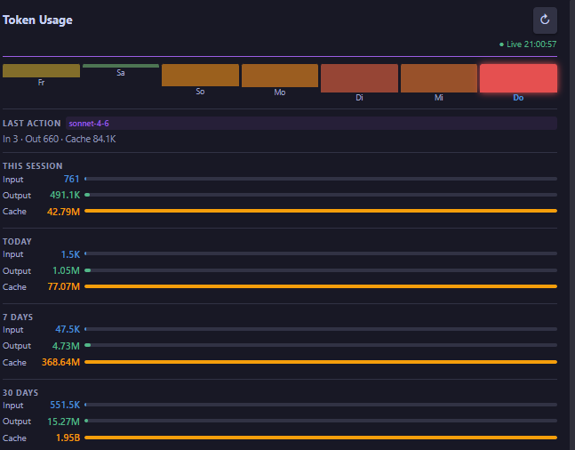

# Token Usage

Token Usage is an Obsidian plugin that tracks Claude Code token consumption from locally stored conversation files.

Instead of relying on API access or external dashboards, Token Usage reads Claude Code's local JSONL files and displays real-time token statistics directly inside Obsidian.

Monitor your latest activity, current session, daily usage, 7-day trends, and 30-day consumption without leaving your workspace.

---

## Features

- Real-time token usage tracking via local file watcher
- 7-day bar chart with intensity colors (green = low, red = high usage)
- Usage statistics for:
  - Last Action (model, input, output, cache tokens)
  - Current Session
  - Today
  - Last 7 Days
  - Last 30 Days
- Sidebar integration inside Obsidian
- No API key required
- No external dashboard required
- Local-first and privacy-friendly

---

## Why Token Usage?

As Claude Code usage grows, keeping track of token consumption becomes increasingly important.

Most existing solutions require organization-level API access or live in separate dashboards outside your daily workflow.

Token Usage follows a different approach.

Claude Code already stores detailed usage information locally in JSONL conversation files. Those files contain all relevant token data, timestamps, session identifiers, and model information.

Instead of sending data to another service, Token Usage brings those insights directly into Obsidian, where many users already manage their projects, notes, and knowledge base.

---

## How It Works

Token Usage scans Claude Code conversation files stored at `~/.claude/projects/` and extracts token information from every recorded interaction.

Example entry:

```json
{
  "input_tokens": 3,
  "cache_creation_input_tokens": 16926,
  "cache_read_input_tokens": 0,
  "output_tokens": 252
}
```

The plugin aggregates this data and displays input, output, and cache token counts across multiple time ranges. All calculations happen locally on your device.

---

## Screenshot



*Real-time Claude Code token usage directly in the Obsidian sidebar.*

---

## Installation

### Manual Installation

1. Download the latest release.
2. Create the folder:

```
<vault>/.obsidian/plugins/token-usage/
```

3. Copy the following files into the folder:

```
main.js
manifest.json
styles.css
```

4. Restart Obsidian.
5. Enable **Token Usage** under:

```
Settings → Community Plugins
```

---

## Usage

After enabling the plugin:

1. Click the activity icon in the left sidebar to open the Token Usage panel.
2. Use Claude Code normally — the panel updates automatically whenever a new response is recorded.

No additional setup, API keys, or cloud services required. The plugin auto-detects your Claude Code data at `~/.claude/projects/`.

---

## Settings

| Setting | Default | Description |
|---|---|---|
| Auto-Refresh (seconds) | 30 | Fallback polling interval in addition to the live file watcher |

---

## Privacy

Token Usage is built with a local-first philosophy.

- No data is sent to external services
- No telemetry
- No API keys required
- No cloud processing
- All calculations are performed locally

Your Claude Code usage data remains on your machine.

---

## Roadmap

- Export functionality (CSV / Markdown summary)
- Multi-model breakdown
- Custom reporting periods
- Monthly summaries

---

## Contributing

Contributions, bug reports, feature requests, and suggestions are welcome.

1. Fork the repository
2. Create a feature branch
3. Commit your changes
4. Open a pull request

---

## Support

If you encounter a problem or have an idea for improvement, please open an issue in the GitHub repository.

---

## License

MIT License

See the [LICENSE](LICENSE) file for details.

---

## Acknowledgments

- [Obsidian](https://obsidian.md)
- [Anthropic Claude Code](https://claude.ai/code)
- The Obsidian Plugin Community

---

Built to answer a simple question:

**"How many tokens have I actually used today?"**
