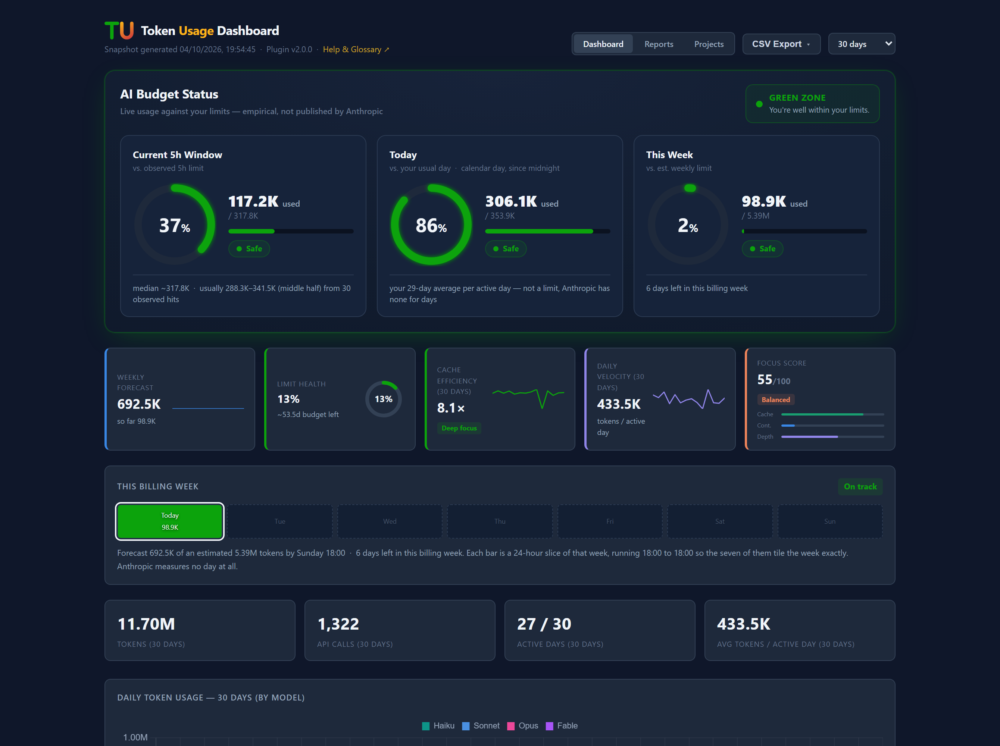

# Token Usage

Token Usage is an Obsidian plugin that tracks Claude Code token consumption from locally stored session files.

Instead of relying on API access or external dashboards, Token Usage reads Claude Code's local JSONL files and displays real-time token statistics directly inside Obsidian — broken down by type, time range, and model.

**[Full documentation & manual](https://www.langeatn.de/media/token-usage/)** — installation, data sources & transparency, core concepts, settings reference, and an FAQ, all on one searchable page (English, German, French).

> **For power users:** Token Usage tracking is machine-wide by default (see [How It Works](#how-it-works)) — but the **[Vault / Project Breakdown](#vault--project-breakdown)** splits that back down by working directory, so you can see exactly which client, project, or vault consumed how many tokens and when. Export it as a standalone Markdown report to hand to a client as a usage/billing reference.

---

## Features

- **Vault/project breakdown for power users** — see exactly which vault or client project consumed how many tokens and when, exportable as a standalone Markdown report for client billing (see [Vault / Project Breakdown](#vault--project-breakdown))
- Live sidebar panel with token breakdown across five time ranges
- Separate display of all four token types: Input, Output, Cache Write (C.Write), Cache Read (C.Read)
- Anchored 5-hour window matching how Anthropic actually meters: it opens with your first message and runs exactly five hours; a new one only starts once that span has elapsed, in fixed chained blocks regardless of pauses, and independently of the weekly reset
- Context sub-labels under each section title — shows scope at a glance ("Anchored window · counts toward rate limit", "Started yesterday · spans multiple days", "Calendar day · since midnight")
- Logarithmic scale for minibar widths — keeps all four token types visually proportional even across large magnitude differences
- Spike warning — amber badge when today's usage is ≥ 2× your personal recent average (window follows your Claude data retention setting)
- Collapsible sections — all five time-range sections fold individually, state persists across refreshes
- **Activity heatmap of your billing week** — one row per calendar day, one cell per two hours. Colour shows pace rather than volume: red marks the rate at which you would arrive exactly at the 5-hour wall as the window closes. Collapsible, with an Active Days panel beside it
- **Two limits, no invented third** — Anthropic enforces a 5-hour window and a weekly cap. There is no daily limit, so the Today figure is not a quota; it compares you against your own recent average per active day
- **The weekly reset calibrates itself** — the weekly cap resets at an hour that differs per account. The plugin reads that hour out of your own session history and says in Settings whether the value was detected or set by hand
- Rate limit tracking — session and weekly limit hits auto-detected from local JSONL files, with threshold estimates and 6-week billing chart in the dashboard
- Model distribution — usage split by Haiku, Sonnet, Opus, and Fable
- HTML dashboard with 30-day charts, model donut, top sessions table, cache efficiency analysis, and rate limit history
- Markdown report export directly into your vault
- Daily archive — compact Markdown summaries written to your vault, so long-term trends survive Claude Code's own 30-day cleanup. Backfills automatically on first install and after any gap
- Adjustable Claude data retention — read and set `cleanupPeriodDays` directly from Settings, no manual JSON editing
- **CSV export, two ways** — from the sidebar header into a configurable vault folder, or via the command palette. Three files (projects, daily detail, key figures), RFC 4180 with a UTF-8 BOM so Excel opens them correctly on the first try. The dashboard additionally offers a browser download
- **Activity calendar over two months** instead of one, so the start of a month is no longer a nearly empty grid
- Built-in Help panel with a 21-entry glossary and cost reference, including "What counts toward a limit", "Activity heatmap", "Weekly reset" and "Archive & long-term data"
- "← Back" button in the header returns from the glossary to the data view
- Language selection — English, German, French, Italian, and Spanish (community translations welcome)
- Command Palette integration for all major actions
- No API key required — reads local files only
- Local-first and privacy-friendly
- Machine-wide by design — reads from a single global location (`~/.claude/projects/`), independent of which Obsidian vault is open. Numbers reflect all Claude Code usage on your machine, not just this vault (broken back down per vault/project — see above)

---

## Why Token Usage?

As Claude Code usage grows, understanding where tokens actually go becomes important for both cost awareness and workflow optimization.

Most existing solutions require organization-level API access or live in separate dashboards outside your daily workflow.

Claude Code already stores detailed usage information locally in JSONL session files. Those files contain all token data, timestamps, session identifiers, and model information.

Token Usage brings those insights directly into Obsidian, where many users already manage their projects, notes, and knowledge base.

Anthropic doesn't publish the actual token limit behind a rate-limit hit — it exists server-side and stays invisible. Token Usage makes it empirically visible instead: every detected rate-limit hit becomes a data point, and enough data points become an estimate of your own session and weekly limits. Not a guess, not marketing language — a number built from what actually happened on your account.

The estimate isn't static — it quietly gets more precise the longer you use Claude Code. Every new rate-limit hit refines it further, so the number you see today is more reliable than the one from your first week.

The 5-hour estimate is shown as a median together with a usual band, the middle half of your observed hits. The same limit is rarely reached at exactly the same total, because other Claude use that Token Usage cannot see (such as claude.ai in the browser) draws on the same limit, so one number alone would look more precise than it is.

---

## How It Works

Token Usage scans Claude Code session files stored at `~/.claude/projects/` and extracts token data from every recorded interaction.

Example JSONL entry:

```json
{
  "input_tokens": 3,
  "cache_creation_input_tokens": 16926,
  "cache_read_input_tokens": 0,
  "output_tokens": 252
}
```

The plugin aggregates all four token fields across sessions and time ranges. All calculations run locally on your device.

A live file watcher detects new activity the moment Claude Code writes a response. A configurable fallback polling interval runs in parallel.

**This directory is global, not per-vault.** `~/.claude/projects/` lives in your user profile, outside any Obsidian vault, and contains one subfolder per working directory Claude Code has ever been run in. Token Usage reads all of them and aggregates the totals. This means:

- Switching between Obsidian vaults has no effect on the numbers — the plugin doesn't read anything from the vault itself, so the same totals show up no matter which vault is open.
- If you use Claude Code in more than one place on this machine (other vaults, plain code repositories, etc.), all of that usage is combined into one number by default. The **Vault / Project Breakdown** below splits that combined number back down per working directory, with no extra setup.

### What is measured (and what isn't)

Because the plugin reads what Claude Code writes to disk, it covers **every way you run Claude Code**: in a terminal, inside Obsidian, in an editor such as VS Code, and the **agent mode built into the Claude desktop app** (which runs Claude Code embedded and writes the same session format to its own location — Token Usage reads that too, since v1.8).

It cannot show **ordinary chat** — the conversations you have in the Claude desktop app or on claude.ai. Those never write token counts to your machine. The only usage signal exposed there is a rounded percentage of your current limit, not the per-request token counts this plugin is built on.

This matters for one number in particular: the **rate limit estimates** in the dashboard are derived from how many tokens were counted when a limit was actually hit. Chat usage draws on the same plan limit but leaves no local trace, so if you use chat alongside Claude Code, the real limit sits somewhat higher than the estimate shown.

---

## Vault / Project Breakdown

*This is the power-user feature: see exactly which vault or client project consumed how many tokens, and when — exportable for billing.*

Every JSONL entry Claude Code writes already carries a `cwd` field — the exact working directory the request ran in. Token Usage uses that to break the machine-wide totals (see above) back down by vault, with no extra setup.

**Two levels, shown in different places on purpose:**

- **Vault (root)** — the working directory a session actually started in. This is what the Dashboard and sidebar show: one row per vault, no further breakdown. A single session's `cwd` can drift during the session itself (e.g. a tool call briefly working inside a subfolder) — Token Usage tracks the session's *start* directory as the stable vault anchor, so that drift never splits one vault's usage into multiple rows or misrepresents how many days you actually worked in it.
- **Project (sub-folder)** — the finer-grained, individual `cwd` values seen within a vault. This level is deliberately **not** shown in the Dashboard (it reflects incidental `cwd` drift, not real per-topic effort, and gets noisy fast) — it only appears in the `Vault_Token_Usage_Projects.md` export's "Project Detail" section, for power users who want to dig further (e.g. pull it into Excel).

**Display name:** just the last folder of the path (e.g. `Thats_Me`), not the full path — kept deliberately simple. If you use more than one Claude Code working directory sharing the same folder name, their usage is combined under that shared name.

**Where to see it:**

- **Dashboard → Projects tab** — an overview table (vault, total tokens, % of the whole, active days, first/last active date) plus a day-by-vault detail table that follows the header's period dropdown, same as the rest of the dashboard. Both tables are vault-level only. Click any column header to sort by it (click again to reverse). See [Dashboard](#dashboard) below.
- **`Vault_Token_Usage_Projects.md` export** — a standalone Markdown report with the same vault-level overview and daily-detail tables, plus an additional "Project Detail" section with the sub-folder breakdown per vault. Written into your vault via the "Create Vault Token Usage Projects report" command (or the path configured in Settings). Handy to hand to a client as a usage/billing reference, separate from your personal `Token Usage Report.md`.

**History:** the per-vault (and per-project) breakdown is written into the same daily archive files (see [Archive](#archive) below) as a nested `byRoot:` block in the frontmatter, so it survives beyond your Claude data retention window exactly like the rest of the archive — no separate backfill step needed.

---

## Screenshot



*The dashboard: where you stand against your 5-hour window and your weekly limit, both estimated from your own measured history.*

---

## What You See in the Sidebar

### Current 5h Window

The current anchored 5-hour window — the period Anthropic actually meters. It opens with your first message and runs exactly five hours; a new window only starts once that span has fully elapsed, chained in fixed five-hour blocks regardless of how much idle time falls in between. This is a real window with a real start time, not a sum of the last five hours — and it is independent of the weekly reset, which runs on its own schedule and does not also start a fresh 5-hour window. Shows Input, Output, C.Write, and C.Read as separate rows; only Input and Output count toward the limit. Sub-label: "Anchored window · counts toward rate limit".

The sidebar is organised as an icon rail with four pages: **Today**, **Calendar**, **Analytics**, and **Settings**. The sections below live on Today; the 7-day and N-day figures sit on Analytics as KPI tiles with sparklines.

### This Session / Today

Two time-range sections, each showing the same four token rows. A small logarithmic bar next to each value keeps all token types visually readable even when magnitudes differ by orders of magnitude (e.g. Input at a few hundred vs C.Read in the millions).

**This Session** and **Today** carry a dynamic sub-label explaining their scope:

- **This Session** — shows the session start time ("Started today at 09:27" or "Started yesterday · spans multiple days"). A session in Claude Code can span multiple calendar days — so "This Session" may be larger than "Today". This is expected.
- **Today** — always shows "Calendar day · since midnight".

These three views — Current 5h Window, This Session, and Today — are independent cuts through the same data. They do not automatically nest inside each other. See the [help page](https://www.langeatn.de/media/token-usage/) for a full explanation.

### Models (last 7 days)

A stacked percentage bar showing the model distribution across the past 7 days, colored by model family:

| Model | Color |
|---|---|
| Haiku | Teal |
| Sonnet | Blue |
| Opus | Pink |
| Fable | Violet |
| Other | Gray |

Model colours deliberately avoid green, amber, and red. In this plugin those three mean good, warning, and critical — a colour either identifies something or judges it, never both.

### C.Write and C.Read

Cache Write (C.Write) and Cache Read (C.Read) are shown as separate rows throughout the sidebar because they have very different cost implications:

- **C.Write** (aqua) — approximately 1.25× standard input price. A one-time cost to establish the cache.
- **C.Read** (violet) — approximately 0.10× standard input price. Ten times cheaper than regular input.

Those are cost ratios, not limit ratios. Neither cache type counts toward the 5-hour window or the weekly cap — that was measured against observed limit hits, not assumed from pricing.

The ratio C.Read ÷ C.Write is the Reuse Factor. A high value means the same context is being reused efficiently across many requests.

---

## Dashboard

The dashboard button in the sidebar header generates a self-contained HTML report and opens it in your default browser.

The dashboard includes:

- **Summary cards** — total tokens, requests, active days, and average tokens per active day, all scaled to your selected Report period (30 days / 60 days / 6 months / 12 months)
- **Daily stacked bar chart** — input, output, and cache tokens by day across the full Report period, blending live session data with the daily archive for anything older than your Claude data retention
- **Cache efficiency section** — line chart with C.Write and C.Read across the full Report period, Reuse Factor card, and a dynamic interpretation of your usage pattern
- **Model distribution donut** — share of each model family over your live data window (recent days, not the full Report period — the archive stores aggregates, not individual requests)
- **Request size histogram** — distribution of tokens per individual request, live data window only, same reason
- **Top sessions table** — the 10 most token-intensive sessions by date and identifier, live data window only, same reason
- **Projects tab** — token usage broken down by vault/project: an overview (which vault, total tokens, share of the whole, active days, first/last active date) plus a day-by-vault detail table for the selected Report period. See [Vault / Project Breakdown](#vault--project-breakdown) below.

- **CSV Export menu** in the header, next to the tabs — downloads the projects overview, the daily detail matrix, or the key figures. These go to your browser's download folder, because a page opened in a browser cannot choose a target directory. For files written straight into your vault, use the CSV button in the sidebar header instead; the menu says so at the point where you click

The dashboard uses Chart.js (loaded once from CDN) and works offline after the first load.

---

## Help Panel

The "?" button in the sidebar header toggles between the data view and a built-in glossary. A "← Back" button appears in the header while the glossary is open — click it to return to the data view without hunting for the "?" button again.

The glossary explains:

- What a token is
- The difference between Input and Output
- What C.Write and C.Read mean and why they matter
- How to read the Reuse Factor
- What the anchored 5-hour window represents and why the countdown shows a tilde (~)
- **What counts toward a limit** — the two real limits, why there is no daily one, and why cache tokens do not count
- **How to read the activity heatmap** — why it spans eight rows, and why colour means pace rather than volume
- **Exporting your data** — the two CSV routes and where each one writes
- **The weekly reset** — how the plugin detects your reset hour and what to do if it cannot
- How the three time views (5-hour window, This Session, Today) relate to each other
- How rate limit estimates are derived from your own history
- How the model colors map to model families
- How sessions are counted
- What is and is not measured
- The archive and long-term data
- Approximate API cost reference per model — costs, not limits

A link at the bottom of the glossary opens the full documentation page at [langeatn.de/media/token-usage/](https://www.langeatn.de/media/token-usage/) in your browser — installation, data sources & transparency, core concepts, the archive, the dashboard, every setting, pricing, and an FAQ, all on one searchable page. The page is available in English, German, French, and Spanish.

---

## Report

The "Create Token Usage report" command (also available via the document icon in the sidebar header) writes a Markdown report file to your vault. The report covers:

- Last action with all four token types
- Current session and today
- 7-day and 30-day summaries
- Cache efficiency ratio over 30 days

The report path is configurable in Settings.

---

## Archive

Claude Code deletes its own session files automatically (30 days by default, configurable via `cleanupPeriodDays`). Once a day's file is gone, no plugin can read it — so Token Usage keeps its own compact, long-term record.

Every day you use Claude Code, the plugin writes one small Markdown file to `Token Usage Archive/` in your vault: YAML frontmatter with the day's totals (input, output, cache write, cache read, calls, sessions, model distribution) plus a short human-readable table. It never stores your actual conversations — aggregates only.

On every refresh, the plugin checks all days still available in Claude Code's local files and backfills any day that doesn't have an archive entry yet. This covers a first install (your existing history gets archived immediately) and reopening after Obsidian was closed for a while (any gap gets filled in, as long as Claude Code hasn't already deleted it).

The archive is on by default and can be turned off in Settings, along with the folder path. See [Known Behavior](#known-behavior) for the honest limit on how far back this can reach.

**The dashboard and report read the archive back**, not just write to it. A "Report period" setting (30 days / 60 days / 6 months / 12 months) controls how far back the daily trend chart, cache-efficiency line, and summary cards go. Anything within your Claude data retention comes from live session files; anything older is filled in from the daily archive automatically — no manual switching between sources. Since a longer period can span vacations, gaps, or quiet weeks, the "Active days" card always shows how many of the selected days actually had usage, and the average-tokens figure is computed per active day, not per calendar day, so a slow month never distorts the number.

---


## Installation

### Community Plugin Directory (recommended)

1. Open Obsidian Settings → Community Plugins
2. Search for **Token Usage**
3. Install and enable

### Manual Installation

1. Download the latest release assets: `main.js`, `manifest.json`, `styles.css`
2. Create the folder `<vault>/.obsidian/plugins/token-usage/`
3. Copy the three files into that folder
4. Restart Obsidian
5. Enable **Token Usage** under Settings → Community Plugins

---

## Usage

After enabling the plugin:

1. Click the activity icon in the left sidebar to open the Token Usage panel.
2. Use Claude Code normally — the panel updates automatically whenever a new response is recorded.
3. Click the chart icon in the panel header to open the HTML dashboard.
4. Click **?** to toggle the built-in glossary.

No additional setup, API keys, or cloud services required.

---

## Command Palette

| Command | Action |
|---|---|
| Open Token Usage | Opens the sidebar panel |
| Create Token Usage report | Writes a Markdown report to your vault |
| Open Token Usage dashboard | Generates and opens the HTML dashboard |
| Create Vault Token Usage Projects report | Writes the per-vault/project breakdown as a separate Markdown file to your vault |
| Export all CSV files | Writes all three CSV files into your configured export folder in the vault |
| Export projects CSV | Writes the per-vault/project overview as CSV |
| Export daily detail CSV | Writes the day × vault matrix as CSV |
| Export key figures CSV | Writes the dashboard key figures as CSV |
| Show what's new | Re-opens the highlights popup for the installed version |

---

## Settings

The order below matches the order on the settings page.

| Setting | Default | Description |
|---|---|---|
| Language | English | Display language for the plugin UI. Switches immediately without restart. Available: English, Deutsch, Français, Italiano, Español |
| Weekly reset | detected automatically | The weekday and hour at which your weekly cap resets. The plugin reads this out of your own session history; the status line says whether the value was detected or set by hand. Only worth touching if detection has nothing to go on yet |
| Report period | 30 days | How far back the dashboard and report look: 30 days, 60 days, 6 months, or 12 months. Beyond your Claude data retention, filled in from the daily archive |
| Enable daily archive | On | Automatically writes a daily Markdown summary to your vault. Turn off if you don't want the plugin creating files |
| Claude data retention (days) | 30 | Reads and writes `cleanupPeriodDays` directly in Claude Code's own settings.json. A backup (.bak) is created automatically before each change |
| Auto-refresh interval (seconds) | 30 | Fallback polling interval in addition to the live file watcher |

**File locations**

| Setting | Default | Description |
|---|---|---|
| Report path | Token Usage Report.md | Vault-relative path for the generated Markdown report |
| Vault report path | Vault_Token_Usage_Projects.md | Vault-relative path for the per-project/vault usage breakdown, a separate file from the main report |
| Dashboard path | Token Usage Dashboard.html | Vault-relative path for the generated HTML dashboard |
| Archive folder in vault | Token Usage Archive | Vault-relative folder for the daily archive files |
| CSV export folder in vault | Token Usage Exports | Vault-relative folder for CSV files written from the sidebar or the command palette. Does not affect the dashboard's own download, which goes to your browser's download folder |

---

## Privacy

Token Usage is built with a local-first philosophy.

- No data is sent to external services
- No telemetry
- No API keys required
- No cloud processing
- All calculations are performed locally on your device

Your Claude Code usage data stays on your machine.

---

## Known Behavior

**Claude Code updates may briefly affect historical data.**

Token Usage reads the JSONL files that Claude Code writes locally. When Anthropic ships a Claude Code update that changes how session data is recorded or how internal telemetry is counted, historical values in the 30-day view may temporarily show anomalies.

We review Anthropic's release notes with each Claude Code update and adapt the plugin where needed. Significant compatibility changes are documented in the changelog.

> **Note for Claude Code v2.1.196 (August 2026):** This update fixed a bug where parallel requests were double-counted in telemetry output. Sessions recorded before the fix may show slightly elevated values in the 30-day view. This resolves automatically as those sessions age out of the 30-day window — expected by approximately end of August 2026.

---

**Version number in the sidebar footer shows an outdated version after an update.**

This is not a code bug. Obsidian caches the loaded plugin manifest in memory. Toggling the plugin off and on may not fully reinitialize the manifest object. Fix: perform a full Obsidian restart after updating the plugin files. The correct version will display after restart.

**The weekly consumption chart uses your own billing week boundary.**

The weekly cap resets at a weekday and hour that differs per account, so there is no single correct boundary to hard-code. Up to v1.9.0 the plugin assumed Sunday 18:00 Europe/Berlin, which was right for exactly one timezone and silently wrong everywhere else. Since v2.0.0 it reads your reset hour out of your own session history and aligns the chart to that; Settings shows whether the value was detected or set by hand.

Weeks in which the weekly rate limit was reached are highlighted. Token counts in the rate limits table show the full billing-week total for weekly hits and the 5-hour window total for session hits — these are the metrics that correspond directly to each limit type.

---

**The 5-hour reset countdown may differ from Claude's own display.**

The footer shows "Claude 5h resets in: ~Xh Ym". The tilde (~) is intentional — it signals an approximation. Claude Code writes session data to local files after each response completes, not at the moment you send your first message. A long first response (context loading, file reading) can take 10 to 25 minutes before anything is written to the log. The plugin's countdown therefore starts from the first recorded timestamp, which may lag behind the actual session start. For the precise reset time, check the plan usage section in Claude Code or on claude.ai.

---

**The archive backfills, but only what still exists on disk.**

Claude Code deletes its own session files automatically — 30 days by default, or whatever you've set for `cleanupPeriodDays`. The plugin's archive (a small Markdown summary per day, written to a folder in your vault — see [Archive](#archive) below) exists to survive that deletion. Every time the plugin refreshes, it checks all days still available locally and backfills any day that doesn't have an archive file yet — including a first install (it archives your existing history immediately) and reopening after Obsidian was closed for a while.

The limit is physical, not a bug: the archive can only save what's still on disk at the moment it runs. If Obsidian stays closed longer than your retention period, the days in between are deleted by Claude Code before the plugin ever gets a chance to see them, and that gap is unrecoverable. If you use Obsidian less than daily, increase "Claude data retention (days)" in Settings to widen the safety margin.

---

**Platform support: Windows, macOS, and Linux all work the same way.**

The core of the plugin — reading `~/.claude/projects/`, writing the archive, generating reports — has always been platform-neutral (Node's `os.homedir()` resolves correctly everywhere), regardless of what OS you're on. The one platform-specific code path, the Claude Desktop Agent Mode session finder added in v1.8.0, is a Windows-only necessity: the Windows desktop app runs its embedded Claude Code inside an MSIX app-container sandbox that virtualises the filesystem, so Agent Mode sessions physically land somewhere other than the ordinary `~/.claude/projects/`. macOS and Linux have no equivalent sandboxing layer — Agent Mode sessions there (where the feature exists) are expected to land directly in the same `~/.claude/projects/` the plugin already reads, needing no extra code. See [Data Sources & Transparency](https://www.langeatn.de/media/token-usage/#data-sources) in the full documentation for the exact breakdown per platform.

---

## Contributing

Contributions, bug reports, feature requests, and suggestions are welcome.

1. Fork the repository
2. Create a feature branch
3. Commit your changes
4. Open a pull request

---

## Support

If you encounter a problem or have an idea for improvement, please open an issue in the GitHub repository.

Full documentation, glossary, and manual — installation, data sources & transparency, core concepts, settings reference, FAQ, all searchable on one page: [langeatn.de/media/token-usage/](https://www.langeatn.de/media/token-usage/)

---

## License

MIT License — see the [LICENSE](LICENSE) file for details.

---

## Acknowledgments

- [Obsidian](https://obsidian.md)
- [Anthropic Claude Code](https://claude.ai/code)
- The Obsidian Plugin Community

---

## Changelog

### v2.0.0 — October 2026

Three things this plugin believed about Anthropic's rate limits were wrong. All three are corrected here, which is why your numbers may look different after updating.

**Corrections**

- **There is no daily limit.** Earlier versions measured Today against "a fair daily share" of the weekly cap — a number the plugin invented by dividing the weekly limit by seven. Anthropic enforces no such limit, so that comparison held a real day against an imaginary budget. Today is now shown against your own 29-day average per active day: it claims no quota, it tells you whether today is busier or quieter than usual
- **The 5-hour window is anchored, not rolling.** It opens with your first message and runs exactly five hours; a new window only starts once that span has fully elapsed, chained in fixed blocks regardless of pauses in between. Previous versions summed "the last five hours from now", which at a window turnover mixed the tail of the old window with the head of the new one — a figure that belonged to neither, precisely when you most wanted to see that your budget had reset
- **Only input and output count toward a limit.** Cache reads and cache writes do not. This was verified against 80+ observed limit hits rather than assumed: a weighted model was tested, and the weights that best explained the real data were zero for both cache types. The resulting median 5-hour budget matches what users actually observe

**New**

- **Activity heatmap built around your billing week** — one row per calendar day, twelve 2-hour bubbles per row, spanning your actual weekly window from reset hour to reset hour. Because that window touches eight calendar dates, the view shows eight rows, with the cells outside the window visibly inactive. Collapsible, with an Active Days panel beside it
- **The weekly reset detects itself.** The weekly limit resets at an hour that differs per account. The plugin now calibrates that hour from your own session history instead of asking you to guess it, and says in Settings whether the value was detected or set by hand
- **CSV export, two ways** — from the sidebar header into a configurable vault folder, or via the command palette. Three files (projects, daily detail, key figures), RFC 4180 with a UTF-8 BOM so Excel opens them correctly on the first try
- **5-hour estimate with a usual band** — the sidebar and the dashboard show the median and the middle half of your observed hits (for example "usually between 214K and 364K"), and the CSV export carries both ends. The estimate itself is now measured inside the anchored 5-hour windows, the same way the gauge counts, so the two are directly comparable; numbers may therefore shift slightly after updating.
- **Calendar shows two months** instead of one, so the start of a month is no longer a nearly empty grid
- **Spanish** — the plugin UI and the full glossary are now available in Spanish, alongside English, German, French, and Italian

**Changed**

- **New look** — the colour world has been rebuilt around one rule: a colour either identifies a token type or signals status, never both. Previously the same green could mean "output tokens" in one panel and "you are fine" in the next
- **The Classic sidebar has been removed.** What was opt-in as "NextGen" is now simply the sidebar; the Sidebar appearance setting is gone

### v1.9.0 — September 2026

- **Dashboard: Limit Hero banner** — the empirical session, daily-pacing, and weekly limit estimates now get a prominent banner at the very top of the dashboard, above the KPI cards, instead of being buried in a KPI card and a data table further down
- **Sidebar: Limit Pulse (NextGen)** — the same Today-vs-fair-daily-share and this-week-vs-estimated-weekly-limit numbers now sit at the very top of the Today page too, so you see them the moment you open the sidebar, no dashboard needed. Same underlying calculation as the Dashboard's Limit Hero — the two can never show different numbers
- **Activity calendar: bigger hover target** — the tooltip now lives on the whole day cell, not just the small colored dot, making it much easier to hit with the mouse
- **Activity calendar: per-day notes** — click any day to add a short personal note about that day's usage. Purely local, stored in plugin settings, shown as a small marker on the day and in its tooltip

- **Cross-platform clarity** — Token Usage already worked fully on macOS and Linux: the core session reading has always been platform-neutral (`~/.claude/projects/` via Node's `os.homedir()`), no code change was needed there
- **Agent Mode discovery correctly scoped to Windows** — the Claude Desktop Agent Mode session finder added in v1.8.0 turned out to be a Windows-only necessity, since only the Windows app runs its embedded Claude Code inside an MSIX sandbox that virtualises the filesystem. On macOS/Linux, Agent Mode sessions already land in the same standard `~/.claude/projects/` location the plugin already reads — no extra path guessing needed or added there
- Removed a briefly-added, unverified Windows-Store-style path guess for macOS, replaced with a documented, evidence-based platform boundary in the code (see [claude-dev.tools/docs/log-locations](https://claude-dev.tools/docs/log-locations) for the underlying reference)
- Documentation updated with an explicit note on where session data lives per platform

### v1.8.0 — September 2026

- **Activity calendar** (NextGen sidebar) — a month grid pinned to the bottom of every rail page, one colored dot per day sized against your own recent daily average (green below, amber around, red for a 2×+ spike). Navigate back through your history; toggle it off under Settings → Activity calendar
- **Claude desktop app usage now counts** — the agent mode built into the desktop app runs Claude Code and writes the same JSONL session logs to its own location; the plugin now reads those too, so that consumption no longer goes missing from your totals and rate-limit estimates. A one-time archive rebuild on first launch backfills the affected days
- **Dashboard: expandable sub-project detail** — the Projects view stays one row per vault by default; tick "Show sub-project detail" to expand any vault and see its per-subfolder token split inline, not only in the Markdown export
- **Clearer scope** — a new "What is measured" glossary entry and dashboard note make explicit that the plugin covers Claude Code everywhere, but not ordinary Claude chat (which writes no local token counts)
- **Manual** — a chapter-by-chapter guide is taking shape at [langeatn.de/media/token-usage/manual/](https://www.langeatn.de/media/token-usage/manual/); the outline is live, content fills in over the coming releases

### v1.7.1 — September 2026

- **NextGen sidebar** (opt-in, Settings → Sidebar appearance, Classic sidebar unchanged by default) — icon rail navigation (Today / Overview / Settings), a 7-day activity heatmap, and colored KPI tiles with trend sparklines
- **Vault Token Usage Controlling** — the Dashboard's new Projects view breaks token usage down by vault and sub-project, so you can track and compare consumption across multiple vaults (e.g. separate client workspaces) from one place. Sortable overview and day-by-vault detail tables (click any column header, "today first" default), plus a standalone `Vault_Token_Usage_Projects.md` export for billing
- **Redesigned Dashboard** — 5 KPI cards (weekly forecast, limit health, cache efficiency, daily velocity, focus score), a week status bar with on-track forecast, a period dropdown (30/60/180/360 days), and a new Reports tab
- **Historical reporting beyond 30 days** — daily usage is now archived directly in your vault, so 60/90+ day views keep working even after Claude Code rolls off its own local logs
- **Configurable Claude data retention** — control how long the original session log files are kept on disk, right from the plugin settings
- **In-app "What's new" popup** — after updating, a short summary of the latest changes appears once. Reopen it anytime via Command Palette → "Show what's new"

### v1.6.0 — August 2026

- **Multilingual UI** — English, German, and French. Language dropdown in Settings switches immediately without restart. French translation reviewed by a native speaker.
- **Settings button (⚙)** in the sidebar header — opens the plugin settings tab directly without navigating through the Obsidian menu
- **Rate limit auto-detection** — session and weekly limit hits are now read automatically from Claude Code's local JSONL files. No manual button needed. The plugin detects the exact moment a limit was reached and which type it was (session vs. weekly)
- **Dashboard: Rate limits section** — table of all detected limit events with the relevant token metric at the time of the hit (5h window for session limits, full billing-week total for weekly limits), plus empirical estimates for session and weekly limit thresholds derived from your own usage history
- **Dashboard: Weekly consumption chart** — 6-week bar chart aligned to Claude's billing week boundary (Sunday 18:00 → Sunday 18:00 Europe/Berlin), with visual highlight for weeks where the weekly limit was reached
- **Spike warning** — amber badge next to Today when daily consumption is ≥ 2× your personal 29-day average (active days only)
- **Last Action chips** — four colored chips (In / Out / C.Wr / C.Rd) replace the plain-text row in the Last Action section, consistent with the minibar color scheme throughout the sidebar
- **Collapsible sections** — all five time-range sections can be collapsed individually with a click. State persists across data refreshes
- **Window cleared indicator** — shows "Window cleared · full 5h available" in green when the 5h window is empty but activity was recorded in the past 6 hours
- **Bugfix** — zero-token entries are now filtered from the 5h window and no longer affect the countdown or display

### v1.5.0 — August 2026

- **Context sub-labels** under each section title — shows exactly what each time range covers at a glance ("Rolling window · counts toward rate limit", session start time, "Calendar day · since midnight")
- **← Back button** in the glossary header — returns to the data view without hunting for the ? button
- **Logarithmic minibar scale** — all four token types (Input, Output, C.Write, C.Read) stay visually readable even across large magnitude differences
- **Sticky header** — logo and buttons stay pinned when the panel is small or scrolled
- **Bugfix** — C.Write bar was invisible due to a missing CSS class (`.au-bar-purple`)
- **New glossary entry** — "The three time views" explains how Last 5 Hour Session, This Session, and Today are independent cuts through the same data
- **GitHub artifact attestations** — release assets are now cryptographically signed

### v1.4.1 — August 2026

- Redesigned logo header with SVG chart icon and gradient text
- Built-in glossary panel — toggle with the ? button, explains all token concepts and includes an approximate cost reference
- HTML dashboard — 30-day charts, model donut, top sessions table, cache efficiency analysis
- C.Write and C.Read split into separate rows throughout the sidebar
- 7-day stacked model distribution bar (Haiku / Sonnet / Opus / Fable)
- Help page at langeatn.de/media/token-usage/ (English and German, auto-detected)

### v1.0.0 – v1.0.2 — July 2026

- Initial release
- Live file watcher on active Claude Code session
- Token breakdown across Last Action, This Session, Today, 7 Days, 30 Days
- Fallback polling interval (configurable)
- Approved and listed in the Obsidian Community Plugin Directory

---

Built to answer a simple question:

**"Where did all my tokens actually go?"**
